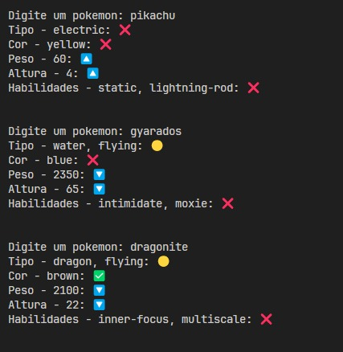
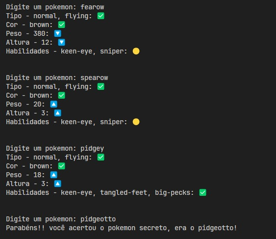

# Jogo-tipo-Pokedle
Um jogo de adivinhação baseado em Pokémon da primeira geração, inspirado no estilo Wordle. Descubra o Pokémon secreto comparando tipo, cor, peso, altura e habilidades!

# 🔍 Jogo "Não É Cópia do Pokedle"

Bem-vindo ao jogo **"Não é cópia do Pokedle"**, um desafio onde você deve adivinhar o Pokémon secreto com base em dicas como tipo, cor, peso, altura e habilidades!

## 🎮 Como jogar

1. Execute o jogo com `codigo.py`
2. Um Pokémon secreto será escolhido aleatoriamente.
3. Você deve digitar o nome de um Pokémon da primeira geração.
4. O jogo comparará os atributos do Pokémon digitado com o Pokémon secreto e exibirá dicas.

## ✅ Regras

- O Pokémon secreto é da **primeira geração** (até o Mew).
- Digite o nome **correto e em minúsculo** (ex: `pikachu`, `bulbasaur`).
- Você receberá pistas com base nos seguintes atributos:
  - Tipo(s)
  - Cor
  - Peso
  - Altura
  - Habilidades

---

## 🧩 Significado dos símbolos

| Símbolo | Significado                         |
|--------|-------------------------------------|
| ✅     | Atributo idêntico ao do Pokémon secreto |
| 🟡     | Há ao menos uma correspondência parcial (tipo ou habilidade) |
| ❌     | Nenhum atributo correspondente       |
| 🔼     | O atributo do seu palpite é **menor** que o do Pokémon secreto |
| 🔽     | O atributo do seu palpite é **maior** que o do Pokémon secreto |

---

## 💡 Exemplo de saída

---

## 🖼️ Screenshots

### Tela inicial


### Tentativa de palpite


### Acerto!


---

## 🚀 Rodando o projeto

```bash
# Instale as dependências (requests)
pip install requests

# Execute o jogo
python nome_do_arquivo.py

